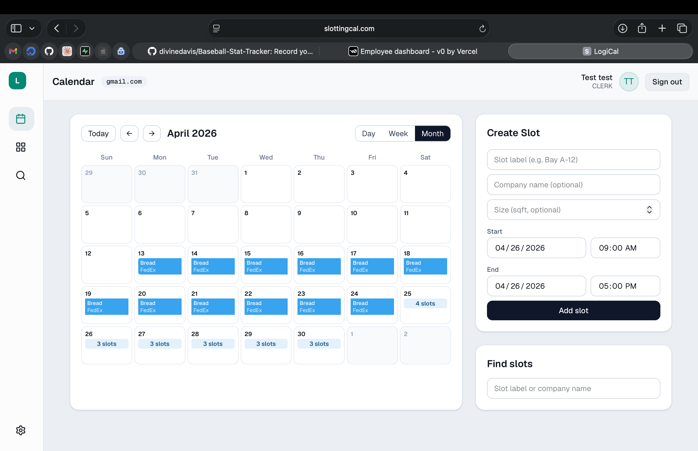
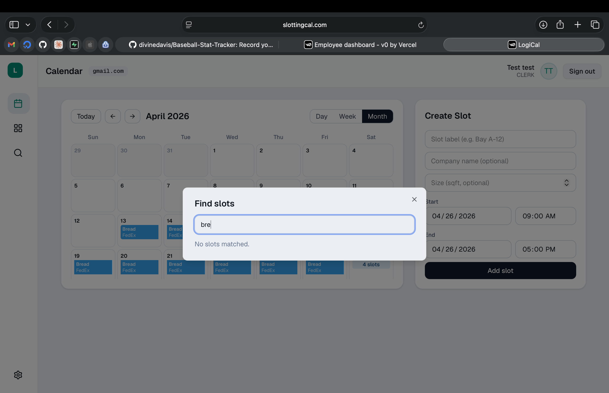

  

# SlottingCal

Slotting calendar for warehouse / dock / storage clerks. Live at **[slottingcal.com](https://slottingcal.com)**.

Clerks (grouped into an org by their email domain — everyone `@acmestorage.com` shares one calendar) create time-bound slots tagged with a company name and manage them on a Day / Week / Month calendar with the ergonomics of Google or Apple Calendar.

## Screenshots

> Drop PNGs into `docs/screenshots/` to populate this section.

| Clerk dashboard (Month) | Find slots | Companies |
| --- | --- | --- |
|  |  |  |

## Clerk dashboard

- **Calendar** with three views — Day, Week, Month — and a `Today` button. The active view persists across refreshes.
- **All-day strip** above the hour grid in Day/Week. Multi-day slots span as a single bar across covered days; in Month they render as a continuous bar across cells (rounded only on the first/last day of the span).
- **Day/Week hour grid** runs 7am–10pm, with the visible window capped to 5pm by default and scroll for later hours. A red "now" line marks the current time on today's column.
- **Click any day** to open a popup of that day's slots with inline edit + delete.
- **Mobile** swaps the calendar grid for an upcoming-day agenda list (multi-day slots fan out across each day they cover).

## Slot creation

- Start day + time and end day + time (single-day or multi-day).
- Optional company name and size (sqft).
- **Autocomplete from history** — both the slot label and company-name inputs surface a dropdown of the top 3 past values you've used (prefix matches first, then contains matches). Click to fill, or press Tab when there's exactly one match to commit it and move on.

## Sidebar actions

- **Companies** — directory of companies registered to your org. Edit phone, email, contact name, address, website, and free-form notes per company.
- **Find** — debounced live search across slot label OR company name; top 3 matches with org, label, company, time range, and size.
- **Export** — pick a Day, Week, or Month and download a CSV of slots in that range. Columns: Company, Start Date, End Date, Size (sqft).

## Stack

- Next.js 14 (App Router) + TypeScript
- Tailwind CSS v4 + shadcn/ui (Radix primitives)
- PostgreSQL + Prisma
- NextAuth (credentials provider, role-gated)

## Routes

- `/` — landing, pick customer or clerk
- `/clerk/signup`, `/clerk/signin`, `/clerk/dashboard`
- `/customer/signup`, `/customer/signin`, `/customer/dashboard`

API:

- `POST /api/register` — signup for either role
- `GET|POST /api/slots` — list / create slots (clerk-scoped)
- `PATCH|DELETE /api/slots/:id` — edit or delete a slot (org-scoped)
- `GET /api/slots/search?q=…` — search slots by label or company (clerk-only)
- `GET /api/slots/suggestions` — distinct labels and companies the clerk has used (powers autocomplete)
- `GET|POST /api/companies` — list / create companies (clerk-org-scoped)
- `PATCH|DELETE /api/companies/:id` — edit or delete a company (clerk-org-scoped)
- `GET|POST /api/holds`, `PATCH|DELETE /api/holds/:id`, `GET|POST /api/holds/:id/messages` — customer hold + messaging endpoints (the visible Holds list has been removed from the clerk UI; the API remains)
